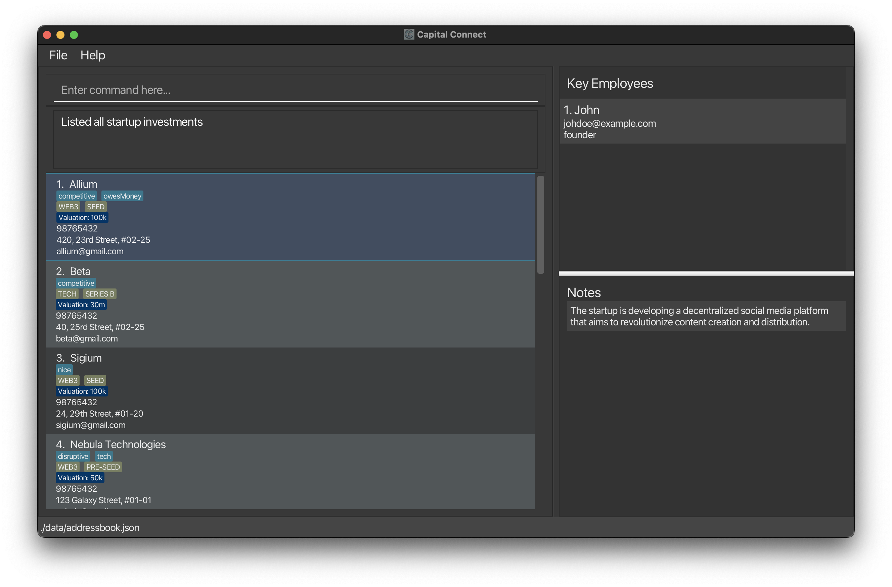
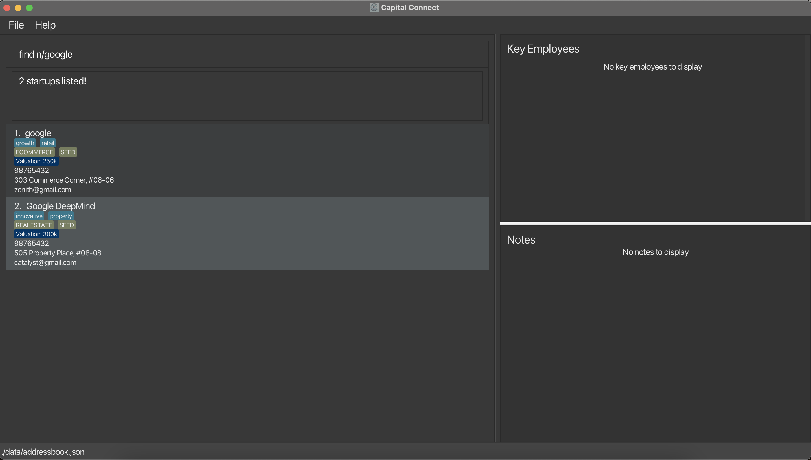
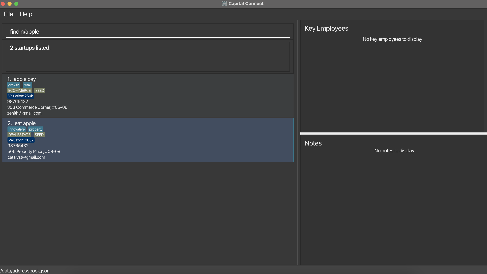
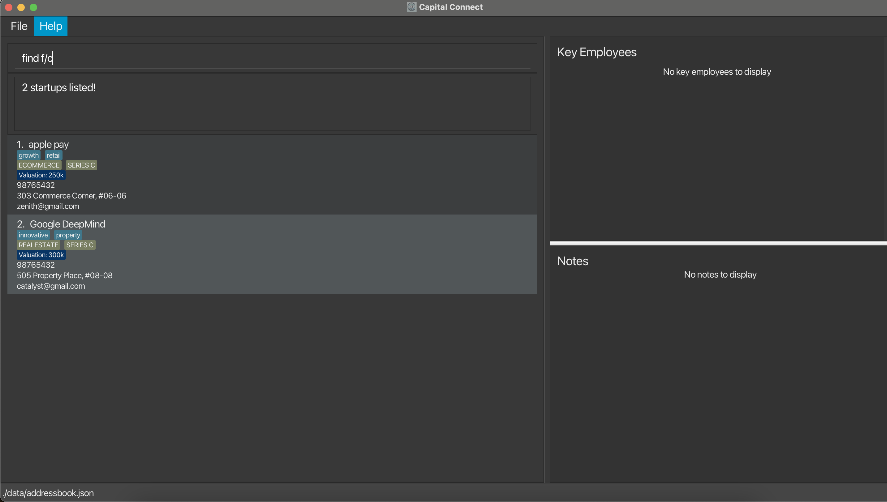
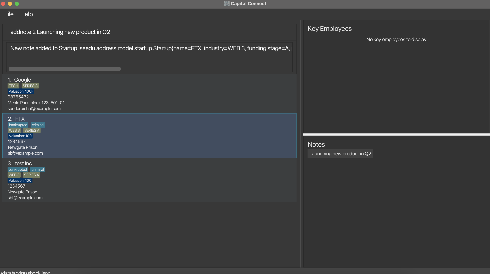
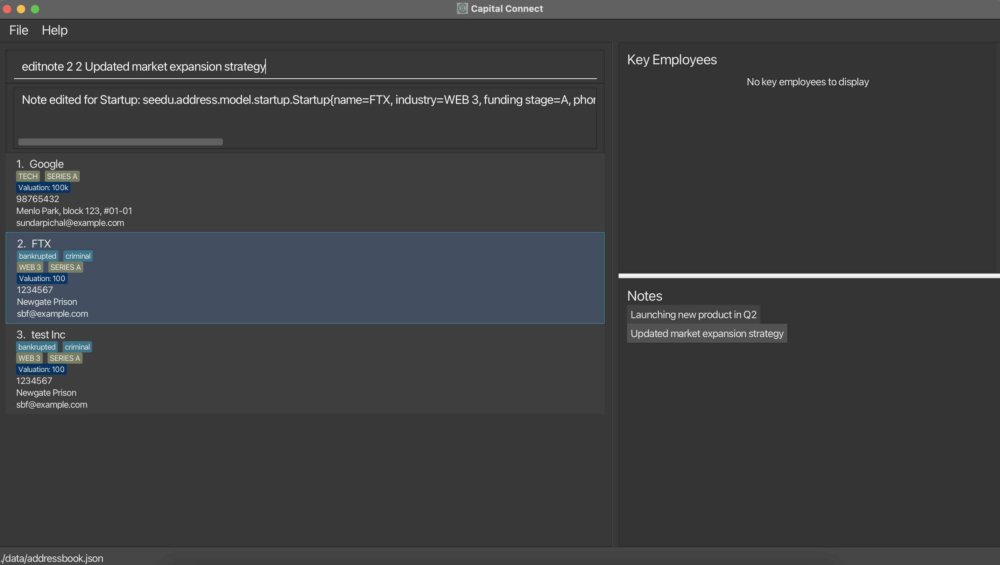
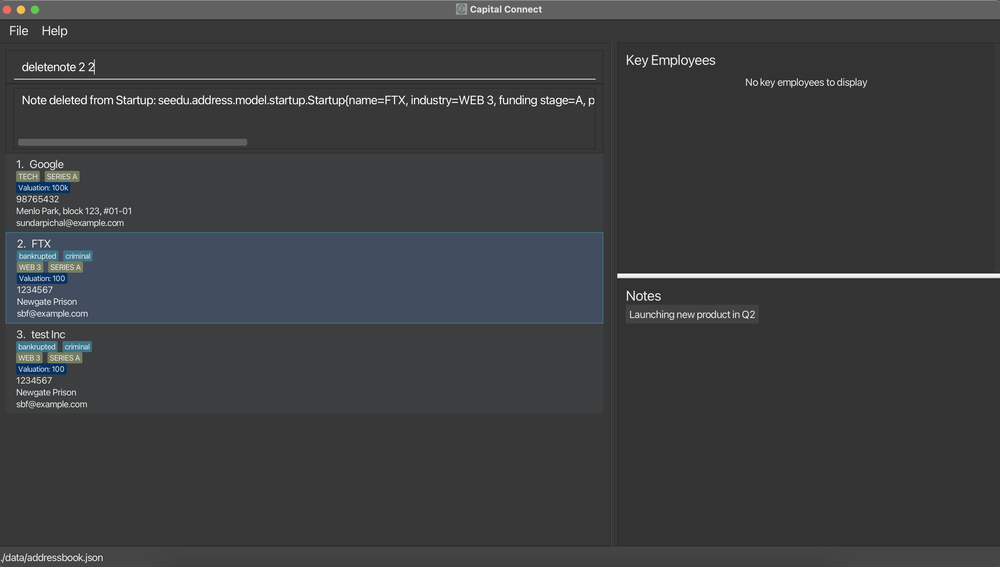
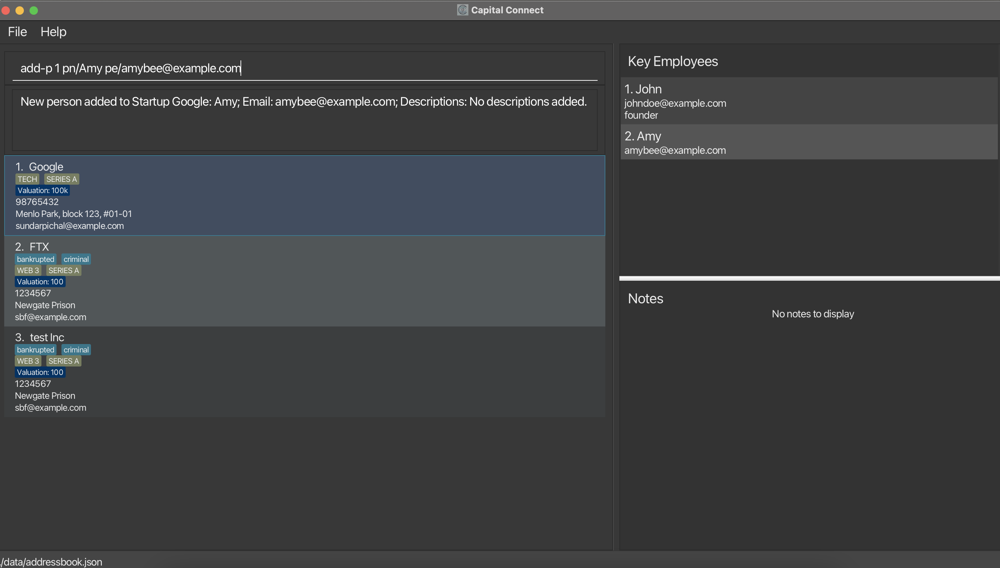
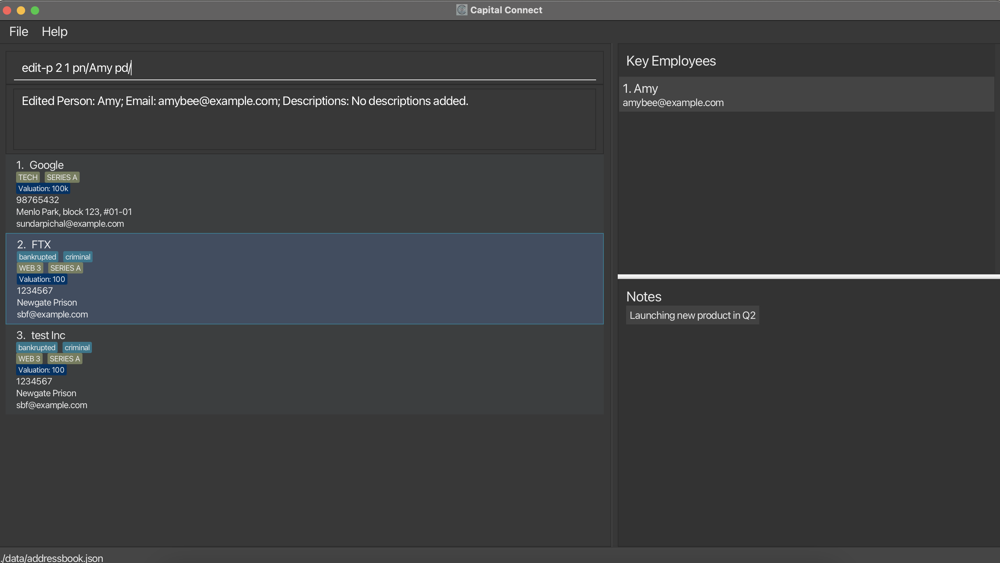
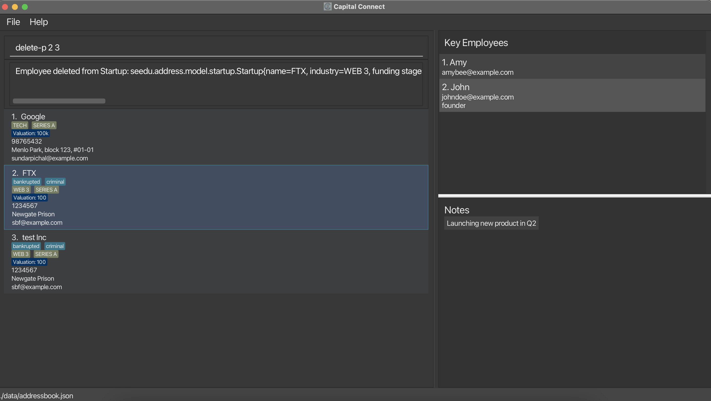

# CapitalConnect User Guide

**Welcome to CapitalConnect: Your Portfolio Powerhouse!**

Do you ever feel like your startup portfolio is a tangled mess of spreadsheets and endless documents? You're not alone.
As a Venture Capital Portfolio Manager, juggling diverse investments across industries can be a complex challenge.

Our application is build for the aspiring venture capitalist! You are a professional on the lookout for the next Google.
You are passionate about innovative and new technologies. Most importantly, you want to **make your network your net-worth.**

**CapitalConnect is here to revolutionize your experience**.

As a desktop app for managing startup investments and contacts, CapitalConnect is optimized
for use via **a Line Interface (CLI)** while still having the benefits of a Graphical User Interface (GUI). If you can
type fast, CapitalConnect can get your investment management done faster than traditional GUI apps.

We streamline and wrap **everything** in a sleek, easy to use platform. And by everything, we mean everything from

- Adding new startups to your watch list!
- Tracking the profile of various startups!
- Categorising and searching for startups based on your requirements!

and much, much, more!

This user guide is your key to unlocking the full potential of the app.  We'll walk you through every step, from
effortlessly adding new investments to categorizing them by industry and funding stage.  Forget the days of chasing
down data – CapitalConnect empowers you to track your startup investments with ease.

Throughout this guide, we'll use clear, step-by-step instructions and helpful screenshots to ensure you master
CapitalConnect in no time.  So, buckle up and get ready to experience a smoother, more efficient way to manage your
startup investments!

--------------------------------------------------------------------------------------------------------------------

## Table Of Contents

<!-- * Table of Contents -->
<page-nav-print />

--------------------------------------------------------------------------------------------------------------------

## Quick start

1. Ensure you have Java `11` or above installed in your Computer.

2. Download the latest `capitalconnect.jar` from [here](https://github.com/AY2324S2-CS2103T-W09-2/tp).

3. Copy the file to the folder you want to use as the _home folder_ for CapitalConnect.

4. Open a command terminal, `cd` into the folder you put the jar file in, and use the `java -jar capitalconnect.jar` command to run the application. 
   A GUI similar to the below should appear in a few seconds. Note how the app contains some sample data. 
   

5. Type the command in the command box and press Enter to execute it. e.g. typing **`help`** and pressing Enter will open the help window. 
   Some example commands you can try:

   * `list` : Lists all startups.

   * `add n/Pichu p/98765432 i/finance v/10 f/B e/pichuhr@example.com a/pichu street, block 123, #01-01` : Adds a startup called `Pichu` to CapitalConnect.

   * `delete 3` : Deletes the 3rd startup shown in the current list.

   * `clear` : Deletes all startups.

   * `exit` : Exits the app.

6. Refer to the [Features](#features) below for details of each command.

--------------------------------------------------------------------------------------------------------------------

## Features

<box type="info" seamless>

**Notes about the command format:**

* Words in `UPPER_CASE` are the parameters to be supplied by the user. 
  e.g. in `add n/NAME`, `NAME` is a parameter which can be used as `add n/capital connect`.

* Items in square brackets are optional. 
  e.g `n/NAME [t/TAG]` can be used as `n/capital connect t/stealth startup` or as `n/capital connect`.

* Items with `…`​ after them can be used multiple times including zero times. 
  e.g. `[t/TAG]…​` can be used as ` ` (i.e. 0 times), `t/stealth startup`, `t/steath startup t/mvp` etc.

* Parameters can be in any order. 
  e.g. if the command specifies `n/NAME p/PHONE_NUMBER`, `p/PHONE_NUMBER n/NAME` is also acceptable.

* Extraneous parameters for commands that do not take in parameters (such as `help`, `list`, `exit` and `clear`) will be ignored. 
  e.g. if the command specifies `help 123`, it will be interpreted as `help`.

* Currently selected startup card will appear blue. 
  e.g. in the image below, the currently selected startup is `Allium`.
  

* The key employees and notes displayed in the key employee box and note box belongs to the currently selected startup.

* If you are using a PDF version of this document, be careful when copying and pasting commands that span multiple lines as space characters surrounding line-breaks may be omitted when copied over to the application.
</box>

### Viewing help : `help`

Shows a message explaining how to access the help page.

Format: `help`

### Adding a startup: `add`

Adds a startup to the address book.

Format: `add n/NAME p/PHONE_NUMBER i/INDUSTRY f/FUNDING_STAGE e/EMAIL a/ADDRESS v/VALUATION [t/TAG]…​`

<box type="info" seamless>

* We restrict `v/VALUATION` to be a value between 0 and 5 Trillion. (Note that the most expensive company is only valued at around 3 Trillion as of April 10, 2024) For now, there is no way to specify currency denomination and values have to be input in integer form, I.e. To reflect a valuation of `10k`, the user must input `10000`. Additionally, the input value is truncated to 4 characters to allow for a clean display. I.e. A input of `101800` will be displayed as a 4 character `101k`, `123200010` to `123m`.

* We only support traditional funding stages, hence inputs for `FUNDING_STAGE` must be either `S`, `PS`, `A`, `B` or `C`.
  `A`, `B`, `C` represents the respective funding series whilst `PS` refers to pre-seed and `S` refers to the seed stage. For more information about funding stages, see [here](https://www.indeed.com/career-advice/career-development/startup-funding-stages)!

* `[t/TAG]` variables are not length-limited. We also do not allow duplicate `[t/TAG]`, however `[t/TAG]` is case-sensitive, hence it is possible for a startup to have both the tags `inDebt` and `InDebt` at the same time.

* Note that `n/NAME` is currently case-sensitive in CapitalConnect, hence it is possible to have a startup with the name `Google` and another with the name `google` on CapitalConnect at the same time.
</box>

<box type="tip" seamless>

**Tip:** Use `t/TAG` to store information that you need to easily view!
</box>

<box type="tip" seamless>

**Tip:** A startup can have any number of tags (including 0)
</box>

<box type="tip" seamless>

**Tip:** We understand that profitable investments requires prospecting a large range of industries. Hence, we have no restrictions on `INDUSTRY`!
We let **you** decide how specific you want to define your startup categories by! If `Tech` is too general, you can now use more specific industry categories, such as
`web 3`, `AI`, `IAAS`!
</box>

Examples:
* `add n/Google p/98765432 e/sundarpichal@example.com v/100000 a/Menlo Park, block 123, #01-01 f/A i/tech`
* `add n/FTX t/bankrupted e/sbf@example.com v/100 a/Newgate Prison p/1234567 t/criminal f/A i/web 3`

### Listing all startups : `list`

Shows a list of all startups in the address book.

Format: `list`

### Editing a startup : `edit`

Edits an existing startup in the address book.

Format: `edit INDEX [n/NAME] [p/PHONE] [v/VALUATION] [f/FUNDING_STAGE] [i/INDUSTRY] [e/EMAIL] [a/ADDRESS] [t/TAG]…​`

* Edits the startup at the specified `INDEX`. The index refers to the index number shown in the displayed startup list. The index **must be a positive integer** 1, 2, 3, …​
* At least one of the optional fields must be provided.
* Existing values will be updated to the input values.
* When editing tags, the existing tags of the startup will be removed i.e adding of tags is not cumulative.
* You can remove all the startup’s tags by typing `t/` without
    specifying any tags after it.

Examples:
*  `edit 1 p/91234567 e/stripe@example.com` Edits the phone number and email address of the 1st startup to be `91234567` and `stripe@example.com` respectively.
*  `edit 2 n/Stripe t/` Edits the name of the 2nd startup to be `Stripe` and clears all existing tags.

<box type="tip" seamless>

**Tip:** The same input rules for `add` applies here! An invalid input will throw an error.
</box>

### Locating startups by name: `find n/`

Finds startups with names that contain any of the given keywords.

Format: `find n/NAME [MORE_NAME]`

* The search is case-insensitive. e.g `apple` will match `Apple`.
* The order of the keywords does not matter. e.g. `Jane Street` will match `Street Jane`.
* Only the name is searched.
* Only full words will be matched. e.g. `Microsoft` will not match `Microsofts`.
* Startups matching at least one keyword will be returned (i.e. `OR` search).
  e.g. `Jane Street` will return `Jane Technologies`, `State Street`.
* We understand that you might want to use partial matching to find the matching startup, but this feature is currently under development. This feature will be dropped soon!

Examples:
* `find n/Google` returns `google` and `Google Deepmind`

  

* `find n/apple` returns `apple pay`, `eat apple` 

  

### Locating startups by funding stage: `find f/`

Finds startups that match the funding stages you are looking for.

Format: `find f/FUNDING_STAGE [MORE_FUNDING_STAGES]`

* The search is case-insensitive. e.g `a` will match `A`
* Multiple funding stages can be looked up in a single search.
* The order of the keywords does not matter. e.g. `A B` will match `B A`.
* Only the funding stage is searched.
* Again, we only support traditional funding stages, so inputs for `FUNDING_STAGE` should be either `S`, `PS`, `A`, `B` or `C`in order to find a matching startup.
  `A`, `B`, `C` represents the respective funding series whilst `PS` refers to pre-seed and `S` refers to the seed stage.
* Please take note that inputs other than the ones mentioned above will also be accepted, but zero matching startups will be listed.

Examples:
* `find f/C` returns startups that are currently in Series C funding.

  

### Locating startups by industry: `find i/`

Finds startups with industries that match any of the given keywords.

Format: `find i/INDUSTRY [MORE_INDUSTRIES]`

* The search is case-insensitive. e.g `ai` will match `AI`.
* Startups from multiple industries can be looked up in a single search.
* The order of the keywords does not matter. e.g. `AI WEB3` will match `WEB3 AI`.
* Only the industry is searched.

Examples:
* `find i/AI` returns startups that have AI tagged within their industry.

  

### Deleting a startup : `delete`

Deletes the specified startup from CapitalConnect.

Format: `delete INDEX`

* Deletes the startup at the specified `INDEX`.
* The index refers to the index number shown in the displayed startup list.
* The index **must be a positive integer** 1, 2, 3, …​.

Examples:
* `list` followed by `delete 2` deletes the 2nd startup in the address book.
* `find n/apple` followed by `delete 1` deletes the 1st startup in the results of the `find` command.

## Notes

Notes are useful in tracking additional information about your startup when making your investment decisions!

### Adding a Note to a Startup: `addnote`

Adds a note to an existing startup in the address book.

Format: `addnote INDEX NOTE`

- Adds a note to the startup at the specified `INDEX`. The index refers to the index number shown in the displayed startup list. The index **must be a positive integer** 1, 2, 3, …​
- The `NOTE` field must be provided and cannot be empty.
- The `INDEX` field refers to the startups in the list currently displayed. If the `INDEX` does not exist in the current startup list, the command will fail.
- There was no limit set to the length of the note, but it is 2,147,483,647 characters theoretically!
- The was also no limit set to the number of notes, so the likely limit is 2,147,483,647 Notes or the memory of your system, whichever comes first!
- Duplicate notes are allowed! This is to give users freedom to decide how you'd like to organise and use the notes section.
- We understand that you might want to have a number to know the index of the note you're looking at. This feature is currently a work in progress and will be dropped soon too!

Examples:
- `addnote 1 Secured Series A funding` Adds a note about securing Series A funding to the 1st startup.
- `addnote 2 Launching new product in Q2` Adds a note about a product launch in Q2 to the 2nd startup.

<box type="info" seamless>

What's the difference between a `NOTE` and a `t/TAG`?

We aim for `NOTE` to be used to store longer, more verbose details! Whereas `t/TAG` should be used to store information that needs to be easy to reach and accessible!

Consider the storing the following: "The startup founder seems very passionate in his speech", storing this with `t/TAG`
may not be the best idea as it is verbose, and it might be information you don't need on hand.

However, if the founder's passion is something important to you, and you want the ability to know this detail about a startup
without clicking into it on the user interface, you could tag the startup with `t/passionate`.
""
</box>

<box type="tip" seamless>

**Tip:** Use specific and concise notes to effectively capture important information about each startup.
</box>

---

### Editing a Note of a Startup: `editnote`

Edits an existing note of a startup in the address book.

Format: `editnote INDEX NOTE_INDEX NOTE`

- `INDEX` refers to the position of the startup in the displayed startup list. It must be a positive integer (e.g., 1, 2, 3, ...) and a startup must exist corresponding to this index in the list.
- `NOTE_INDEX` refers to the position of the note within the selected startup's list of notes. It must also be a positive integer. A Note must also exist in the index of note list belonging to the startup.
- `NOTE` is the new text that will replace the existing note. This field must not be empty.
- We're working on a feature to display note indexes for easier editing. For now, please count the notes from the top. This feature will be available soon!

Examples:
- `editnote 1 1 Revised Series A valuation` Edits the first note of the 1st startup to "Revised Series A valuation".
- `editnote 2 2 Updated market expansion strategy` Edits the second note of the 2nd startup with updated expansion strategy details.

<box type="tip" seamless>

**Tip:** Editing notes allows you to keep information about startups up to date with the latest developments.
</box>

---

### Deleting a Note from a Startup: `deletenote`

Deletes a note from an existing startup in the address book.

Format: `deletenote INDEX NOTE_INDEX`

- Deletes the note located at `NOTE_INDEX` from the startup specified by `INDEX`. Both indexes refer to the index number of the startup in the currently displayed startup list and the individual note in the note list within that startup, respectively.
- Ensure both INDEX and NOTE_INDEX are positive integers (e.g., 1, 2, 3, …​).
- Both indexes must accurately point to an existing startup and its respective note. If either index is incorrect, the command will not execute successfully.
- We understand that you would need to know the index of the note you're looking at to delete. This feature is currently a work in progress and will be dropped as soon as possible! In the meantime, please count from the first note :)
- We're working on a feature to display note indexes for easier deleting. For now, please count the notes from the top. This feature will be available soon!

Examples:
- `deletenote 1 1` Deletes the first note of the 1st startup.
- `deletenote 2 2` Deletes the second note of the 2nd startup.

<box type="tip" seamless>

**Tip:** Use the `deletenote` command cautiously to ensure important notes are not accidentally removed.
</box>

**Is there any better way to delete all notes quickly?**

Currently, we do not support a feature allowing users to delete all their notes with a single command. However, we understand that this may be useful especially for keeping user storage clean. This will be a feature for a future iteration!

### Adding a person to a startup: `add-p`

Format: `add-p INDEX pn/NAME pe/EMAIL [pd/DESCRIPTION]…​`

* Adds a person to the specified startup at index `INDEX` in CapitalConnect. The index refers to the index number shown in the startup list. The index **must be a positive integer** 1, 2, 3, …​
* Click on the startup card that contains your new person to see the changes.
* The name of the person should be alphanumeric. Although we do not limit the length of your input for your flexibility, take note of the limited space of the display pane. The pane size limitation applies to all fields!

<box type="warning" seamless>

**Caution: Detection of Duplicated Persons**

Note that duplicated persons in one startup are detected by `pe/EMAIL`. We assume that email is unique for every person.
In other words, we assume that it is possible to have 3 Johns in one company, and they all have different emails. Before adding a new person to the startup, always double-check their `pe/EMAIL` to make sure that the person is not added already.
Also take note that we allow one person to work in multiple startups.
</box>

Example:
* `add-p 1 pn/John pe/johndoe@example.com pd/founder` Adds the founder of the first startup John into the company.
* `add-p 1 pn/Amy pe/amybee@example.com` Adds Amy to the first startup.

### Editing a person from a startup: `edit-p`

* Edits the person at the specified `PERSON_INDEX` of startup at index `INDEX`. The index refers to the index number shown in the displayed key employees and startup list respectively. The index **must be a positive integer** 1, 2, 3, …​
* At least one of the optional fields must be provided.
* Existing values will be updated to the input values.
* When editing descriptions, the existing descriptions of the startup will be removed i.e adding of descriptions is not cumulative.
* You can remove all the person’s descriptions by typing `pd/` without
  specifying any descriptions after it.
* Click on the startup card that contains your edited person to see the changes.

Format: `edit-p INDEX PERSON_INDEX [pn/NAME] [pe/EMAIL] [pd/DESCRIPTION]…​`

Examples:
*  `edit-p 1 1 pn/John pe/johndoe@example.com` Edits the name and email address of the 1st person in the 1st startup to be `John` and `johndoe@example.com` respectively.
*  `edit-p 2 1 pn/Amy pd/` Edits the name of the 1st person of the 2nd startup to be `Amy` and clears all existing descriptions.

<box type="info" seamless>

**Why am I not seeing the changes in the key employee box immediately?**

If you do not see the changes immediately after editing a key employee in your startup, it means that the startup card containing your
edited key employee is currently not selected.

The currently selected startup card will automatically get deselected after you are doing `find` operations, however the information of the last selected startup will
still be displayed in the key employee box, which is why if you are performing person related operations afterward,
it may appear like the information in the key employee box are not being updated.

Rest assured, the information is updated. To ensure you see the updated information, simply click on your startup card after any person-related operation, i.e., `add-p`, `edit-p`, and `delete-p`.
</box>

### Deleting a person from a startup: `delete-p`

* Deletes the person at `PERSON_INDEX` from the startup at the specified `INDEX`. Both indexes refer to the index number shown in the key employees list and startup list respectively. Both indexes **must be positive integers** 1, 2, 3, …​
* Click on the startup card that contained your deleted person to see the changes.

Format: `delete-p INDEX PERSON_INDEX`

Examples:
- `delete-p 1 1` Deletes the 1st person of the 1st startup.
- `delete-p 2 3` Deletes the 3rd person of the 2nd startup.

<box type="tip" seamless>

**Tip:** Always click on the startup card after performing person-related operations to ensure you see the updated information.
</box>

### Clearing all entries : `clear`

Clears all entries from CapitalConnect.

Format: `clear`

<box type="warning" seamless>

**Caution: Irreversible Data Loss**

The `clear` command will permanently removes all startup entries from CapitalConnect and this action is **irreversible**.
Before using the clear command, always double-check to make sure that you absolutely intend to erase all data.
</box>

<box type="tip" seamless>

**Tip:** Use `clear` command to clear up the sample data.
</box>

### Exiting the program : `exit`

Exits the program.

Format: `exit`

### Saving the data

CapitalConnect data are saved in the hard disk automatically after any command that changes the data. There is no need to save manually.

### Editing the data file

CapitalConnect data are saved automatically as a JSON file `[JAR file location]/data/addressbook.json`. Advanced users are welcome to update data directly by editing that data file.

<box type="warning" seamless>

If your changes to the data file makes its format invalid, CapitalConnect will discard all data and start with an empty data file at the next run.  Hence, it is recommended to take a backup of the file before editing it. 
Furthermore, certain edits can cause CapitalConnect to behave in unexpected ways (e.g., if a value entered is outside the acceptable range). Therefore, edit the data file only if you are confident that you can update it correctly.
</box>

--------------------------------------------------------------------------------------------------------------------

## FAQ

**Q**: How do I transfer my data to another Computer? 
**A**: Install the app in the other computer and overwrite the empty data file it creates with the file that contains the data of your previous CapitalConnect home folder.

--------------------------------------------------------------------------------------------------------------------

## Known issues

1. **When using multiple screens**, if you move the application to a secondary screen, and later switch to using only the primary screen, the GUI will open off-screen. The remedy is to delete the `preferences.json` file created by the application before running the application again.

--------------------------------------------------------------------------------------------------------------------

## Command summary

| Action                    | Format, Examples                                                                                                                                                                                                    |
|---------------------------|---------------------------------------------------------------------------------------------------------------------------------------------------------------------------------------------------------------------|
| **Add**                   | `add n/NAME p/PHONE_NUMBER f/FUNDING_STAGE v/VALUATION i/INDUSTRY e/EMAIL a/ADDRESS [t/TAG]…​`   e.g., `add n/Google p/22224444 e/larrypage@example.com a/123, menlo park, 1234665 t/SVbased i/Tech f/A v/10000` |
| **Clear**                 | `clear`                                                                                                                                                                                                             |
| **Delete**                | `delete INDEX`  e.g., `delete 3`                                                                                                                                                                                 |
| **Edit**                  | `edit INDEX [n/NAME] [p/PHONE_NUMBER] [v/VALUATION] [i/INDUSTRY] [f/FUNDING_STAGE] [e/EMAIL] [a/ADDRESS] [t/TAG]…​`  e.g.,`edit 1 n/James Lee e/jameslee@example.com`                                            |
| **Find by Name**          | `find n/NAME [MORE_NAMES]`  e.g., `find n/apple`                                                                                                                                                                 |
| **Find by Funding Stage** | `find f/FUNDING_STAGE [MORE_FUNDING_STAGES]`  e.g., `find f/A`, `find f/A B`                                                                                                                                     |
| **Find by Industry**      | `find i/INDUSTRY [MORE_INDUSTRIES]`  e.g., `find i/AI`, `find i/AI Robotics`                                                                                                                                     |
| **List**                  | `list`                                                                                                                                                                                                              |
| **Help**                  | `help`                                                                                                                                                                                                              |
| **Add Note**              | `addnote INDEX NOTE`   e.g., `addnote 1 Secured Series A funding`                                                                                                                                                |
| **Edit Note**             | `editnote INDEX NOTE_INDEX NOTE`   e.g., `editnote 1 1 Revised Series A valuation`                                                                                                                               |
| **Delete Note**           | `deletenote INDEX NOTE_INDEX`   e.g., `deletenote 1 1`                                                                                                                                                           |
| **Add Person**            | `add-p INDEX pn/NAME pe/EMAIL [pd/DESCRIPTION]…​`   e.g., `add-p 1 pn/John pe/johndoe@example.com pd/founder`                                                                                                    |
| **Edit Person**           | `edit-p INDEX PERSON_INDEX [pn/NAME] [pe/EMAIL] [pd/DESCRIPTION]…​`   e.g., `edit-p 1 1 pn/john pe/johndoe233@example.com pd/founder`                                                                            |
| **Delete Person**         | `delete-p INDEX PERSON_INDEX`   e.g., `delete-p 1 1`                                                                                                                                                             |
